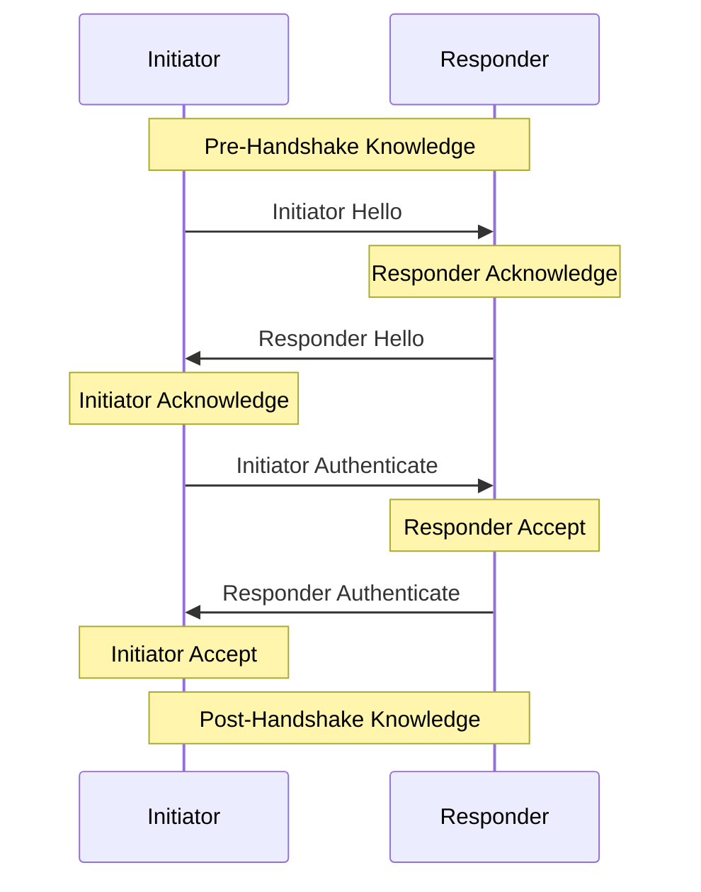

# "Secret Handshake" v2 Specification 🤝

Mutually authenticating key agreement to establish shared secrets over an insecure channel.

## Pre-requsities

- There are two participants:
  - The initiator (client) who dials the connection.
  - The responder (server) who answers the connection.
- Both the initiator and responder have a static Ed25519 (public) verifying and (secret) signing keypair.
  - These will be converted to X25519 public and secret keys as needed.
- The initiator must know the responder's static Ed25519 (public) verifying key before connecting.
- Both the initiator and the responder are expecting to use the same static symmetric network key.

## Security Guarantees

- After a successful handshake the peers have verified each other's public keys.
- The handshake produces a shared secret symmetric key and initial nonce that can be used with a bulk encryption cipher (like [Secret Channel](https://github.com/ahdinosaur/secret-channel)) for exchanging further messages.
- The initiator must know the responder's public key before connecting. The responder learns the initiator's public key during the handshake.
- Once the intiator has proven their identity the responder can decide they don't want to talk to this initiator and disconnect without confirming their own identity.
- A man-in-the-middle cannot learn the public key of either peer.
- Both peers need to know a key that represents the particular network they wish to connect to, however a man-in-the-middle can't learn this key from the handshake. If the handshake succeeds then both ends have confirmed that they wish to use the same network.
- Past handshakes cannot be replayed. Attempting to replay a handshake will not allow an attacker to discover or confirm guesses about the participants' public keys.
- Handshakes provide forward secrecy. Recording a user's network traffic and then later stealing their secret key will not allow an attacker to decrypt their past handshakes.

## Security Disclaimers

- This protocol cannot hide your IP address.
- This protocol does not attempt to obscure packet boundaries.
- If a man-in-the-middle records a session and later compromises the responder's secret key, they will be able to learn the initiator's public key.

## Differences with [Secret Handshake v1](https://github.com/auditdrivencrypto/secret-handshake)

### Authenticated Encryption: v1 uses XSalsa20-Poly1305, v2 uses ChaCha20-Poly1305 (IETF)

For authenticated encryption,

- v1 uses [libsodium's `crypto_secretbox_easy`](https://libsodium.gitbook.io/doc/secret-key_cryptography/secretbox)
  - This uses XSalsa20-Poly1305 and concatentates in the order of (auth_tag, ciphertext).
- v2 uses the [IETF variant of ChaCha20-Poly1305](https://datatracker.ietf.org/doc/html/rfc8439)
  - Corresponds to [libsodium's `crypto_aead_xchacha20poly1305_ietf_encrypt`](https://libsodium.gitbook.io/doc/secret-key_cryptography/aead/chacha20-poly1305/ietf_chacha20-poly1305_construction)
  - This is a more recent cipher and concatenates in the order of (ciphertext, auth_tag).

### Fix mismatch with Secret Handshake paper

In the Secret Handshake paper, the responder's first reply is:

```math
b_p, hmac[K|a*b](b_p)
```

i.e. the HMAC key is the network key _and_ and product of the new ephemerals keys.

In Secret Handshake v1, the responder's first reply was:

```math
hmac[K](b_p), b_p
```

i.e. the HMAC key is only the network key.

(And the order of concatenation is reversed.)

Secret Handshake v2 makes sure to follow the paper for this HMAC key.

Secret Handshake v2 also follows the paper for the order of concatenations on the first two messages:

- Initiator Hello: $`a_p, hmac[K](a_p)`$
- Responder Hello: $`a_p, hmac[K|a*b](a_p)`$

Because this is consistent with the ordering of (ciphertext, auth_tag) in ChaCha20-Poly1305 (IETF).

### Secret Handshake v1 Vulnerability

In 2019 the paper ["Prime, Order Please!"](https://eprint.iacr.org/2019/526.pdf) was released about a vulnerability in Secret Handshake v1.

The vulnerability combines two aspects of intentionally weak public keys:

- X25519: With an intentionally weak public key, the shared secret produced by a Diffie-Hellman with that public key is known, regardless of the other secret key.
- Ed25519: With an intentionally weak public key, it's possible to produce a signature that is a valid signature for any message, with respect to the weak public key.

The first solution in the paper (adopted by Secret Handshake v1) is to reject weak public keys with low order points.

In Secret Handshake v2 we will also follow the second suggestion in the paper:

> Our alternative suggestion is to include the initiator’s and responder’s public key when deriving K1 and K2.
>
> Whilst this second suggestion requires a new version of the protocol and risks incompatibility with older clients, it ensures implementations will not accidentally (and silently) forget the low order point check.

This also follows the advice [on the libsodium scalar multiplication page](https://doc.libsodium.org/advanced/scalar_multiplication):

> `q` represents the X coordinate of a point on the curve. As a result, the number of possible keys is limited to the group size (≈2^252), which is smaller than the key space.
>
> For this reason, and to mitigate subtle attacks due to the fact many (`p`, `n`) pairs produce the same result, using the output of the multiplication `q` directly as a shared key is not recommended.
>
> A better way to compute a shared key is `h(q ‖ pk1 ‖ pk2)`, with `pk1` and `pk2` being the public keys.
>
> By doing so, each party can prove what exact public key they intended to perform a key exchange with (for a given public key, 11 other public keys producing the same shared secret can be trivially computed).

### Initiator Authenticate Payload

Secret Handshake v2 adds an optional extra 32-byte payload to the Initiator Authenticate message, so an initiator can authenticate to a responder who doesn't recognize their static public key, such as an invite code.

## Functions

The following functions will be used:

### Hash: SHA-256

Hash: Given a variable-length message, returns a 32-byte SHA-256 digest

```txt
Hash(msg) -> digest
```

This corresponds to [libsodium's `crypto_hash_256` function](https://libsodium.gitbook.io/doc/advanced/sha-2_hash_function).

### Auth and AuthVerify: HMAC-SHA512-256

Auth (aka [HMAC](https://en.wikipedia.org/wiki/HMAC)): Given a variable-length message and a key, returns a 32-byte authentication tag.

```txt
Auth(key, msg) -> auth_tag
```

This corresponds to [libsodium's `crypto_auth` function](https://libsodium.gitbook.io/doc/secret-key_cryptography/secret-key_authentication).

(Note for other implementations: This returns a SHA-512 hash truncated to 256 bits. This is not the same as the `SHA-512/256` function.)

And AuthVerify: given a variable-length message, a key, and an authentication tag (HMAC), return whether the message is verified.

(This function must execute in constant-time.)

```txt
AuthVerify(key, msg, auth_tag) -> boolean
```

This corresponds to [libsodium's `crypto_auth_verify` function](https://libsodium.gitbook.io/doc/secret-key_cryptography/secret-key_authentication).

### DiffieHellman: [X25519](https://www.rfc-editor.org/rfc/rfc7748.txt)

DiffieHellman: Given a local secret key and a remote public key, generate a shared secret.

(Note: This function MUST check if given public key is weak (has low order), before proceeding to generate a shared secret.)

```txt
DiffieHellman(secret_key, public_key) -> shared_secret
```

This corresponds to [libsodium's `crypto_scalarmult` function](https://libsodium.gitbook.io/doc/advanced/scalar_multiplication)

Scalar multiplication is a function for deriving shared secrets from a pair of secret and public X25519 keys.

The order of arguments matters. In the [libsodium `crypto_scalarmult` function](https://libsodium.gitbook.io/doc/advanced/scalar_multiplication) the secret key is provided first.

Note that static (long-term) keys are Ed25519 and must first be converted to X25519.

### GenerateX25519Keypair

GenerateX25519Keypair: Uses a secure random number generate to generate an X25519 keypair.

```txt
GenerateX25519Keypair() -> (secret_key, public_key)
```

This corresponds to libsodium's:

- [`randombytes_buf`](https://libsodium.gitbook.io/doc/generating_random_data) to generate a buffer of random bytes for the secret key
- [`crypto_scalarmult_base`](https://libsodium.gitbook.io/doc/advanced/scalar_multiplication) to derive the public key from the secret key

### ConvertEd25519ToX25519

ConvertVerifyingEd25519ToPublicX25519: Convert an Ed25519 (public) verifying key to an X25519 public key.

```txt
ConvertVerifyingEd25519ToPublicX25519(verifying_key, msg) -> public_key
```
This corresponds to [libsodium's `crypto_sign_ed25519_pk_to_curve25519` function](https://libsodium.gitbook.io/doc/advanced/ed25519-curve25519)

ConvertSigningEd25519ToSecretX25519: Convert an Ed25519 (secret) signing key an X25519 secret key.

```txt
ConvertSigningEd25519ToSecretX25519(signing_key, msg) -> secret_key
```

This corresponds to [libsodium's `crypto_sign_ed25519_sk_to_curve25519` function](https://libsodium.gitbook.io/doc/advanced/ed25519-curve25519)

### Sign and SigVerify: [Ed25519](https://datatracker.ietf.org/doc/html/rfc8032)

Sign: Given an ED25519 (secret) signing key and a message, return a signature for the message with respect to the signing key.

```txt
Sign(signing_key, msg) -> sig
```

SigVerify: Given an ED25519 (public) verifying key, a message, and a signature, return whether the signature is valid for the message with respect to the verifying key.

```txt
SigVerify(verifying_key, msg, sig) -> boolean
```

### Encrypt and Decrypt: [ChaCha20-Poly1305](https://datatracker.ietf.org/doc/html/rfc8439)

Encrypt: Given a symmetric key, a nonce, and plaintext message, returns an authenticated ciphertext message.

```txt
Encrypt(key, nonce, plaintext) -> ciphertext
```

This corresponds to [libsodium's `crypto_aead_chacha20poly1305_ietf_encrypt` function](https://libsodium.gitbook.io/doc/secret-key_cryptography/aead/chacha20-poly1305/ietf_chacha20-poly1305_construction)

Decrypt: Given a symmetric key, a nonce, and an authenticated ciphertext message, checks whether the message is authentic and decrypts the message into plaintext.

```txt
Decrypt(key, nonce, ciphertext) -> plaintext | null
```

This corresponds to [libsodium's `crypto_aead_chacha20poly1305_ietf_decrypt` function](https://libsodium.gitbook.io/doc/secret-key_cryptography/aead/chacha20-poly1305/ietf_chacha20-poly1305_construction)

### Concat

Concat: Concatenate a set of buffers of bytes together into one buffer of bytes.

```txt
Concat(...buffers) -> buffer
```

## Steps

From the [Secret Handshake Paper](https://dominictarr.github.io/secret-handshake-paper/shs.pdf), here are the steps:

```math
\begin{align*}
    ? \to \;?\;   &: a_{p}, hmac_{K}(a_{p})   \\
    ? \gets \;?\; &: b_{p}, hmac_{[K|a\cdot b]}(b_{p}) \\
    H&=Sign_A(K|B_{p}|hash(a\cdot b))|A_{p} \\
    A \to B       &: Box_{[K|a \cdot b | a \cdot B]}(H)\\
    A \gets B     &:
      Box_{[K|a \cdot b | a \cdot B | A \cdot b]}(Sign_B(K|H|hash(a\cdot b)) )\\
\end{align*}
```

We will break this down into the following sequence:



1. [Pre-Handshake Knowledge](#pre-handshake-knowledge): What is known by Initiator and Responder before the handshake begins
1. [Initiator Hello](#initiator-hello): Initiator sends new ephemeral X22519 public key in cleartext, with an authentication token (using network key).
1. [Responder Acknowledge](#responder-acknowledge): Responder receives initiatior's ephemeral X25519 public key and checks authentication token (using network key).
1. [Responder Hello](#responder-hello): Responder sends new ephemeral X22519 public key in cleartext, with an authentication (using key derived from network key and first shared secret).
1. [Initiator Acknowledge](#initiator-acknowledge): Initiator receives initiator's ephemeral X25519 public key and checks authentication token (using key derived from network key and first shared secret).
1. [Initiator Authenticate](#initiator-authenticate): Initiator sends own static Ed25519 verifying (public) key and a signature of current state (using own static Ed25519 signing key), encrypted with key derived from network key, both ephemeral public keys, and two shared secrets.
1. [Responder Accept](#responder-accept): Responder receives and decrypts initiator's static Ed25519 verifying (public) key, signature, and optional payload. Checks signature matches key. Either accepts initiator based on key or based on optional payload.
1. [Responder Authenticate](#responder-authenticate): Responder sends own static Ed25519 verifying (public) key and a signature of current state (using own static Ed25519 signing key), encrypted with key derived from network key, both ephemeral public keys, and three shared secrets.
1. [Initiator Accept](#initiator-accept): Initiator receives and decrypts responder's signature. Checks signature matches key.
1. [Post-Handshake Knowledge](#post-handshake-knowledge): What is known by initiator and responder after the handshake ends

> _Initiator_ is the computer dialing the TCP connection and _responder_ is the computer receiving it. Once the handshake is complete this distinction goes away.

### Pre-Handshake Knowledge

Before starting the handshake, both the initiator and responder know their own respective static Ed25519 public and secret keypairs.

They both also know and expect to use the same static network key.

The network key is a fixed key of 32 bytes.

The network key allows separate isolated networks to be created, for example private networks or testnets. An eavesdropper cannot extract the network identifier directly from what is sent over the wire, although they could confirm a guess for a network if the network key is publicly known.

The initator also knows the responder's static public key.

### Initiator Hello

The initiator generates a new ephemeral public and secret keypair: $`a`$.

Then sends "Initiator Hello": a message which combines:

- proof that the initiator knows the network key: $`N`$,
- and the initiator's new ephemeral public key: $`a_p`$.

Initiator:

```txt
initiator_hello_msg = Concat(
  initiator_ephemeral_public_key,
  Auth(
    msg: initiator_ephemeral_public_key,
    key: network_key
  )
)
```

Which looks like:

```txt
Initiator Hello: 64-bytes (512-bits)
+----------------------------------+------------------+
|  initiator ephemeral public key  |     auth tag     |
+----------------------------------+------------------+
|          32B (256-bits)          |  32B (256-bits)  |
+----------------------------------+------------------+
```

> `Auth` (aka [HMAC](https://en.wikipedia.org/wiki/HMAC)) and `AuthVerify` are functions to tag and verify a message with regards to a secret key. In this case the network identifier (`N`) is used as the secret key.
>
> Both the message creator and verifier have to know the same message and secret key for the verification to succeed, but the secret key is not revealed to an eavesdropper.
>
> Throughout the protocol, all instances of `Auth` use HMAC-SHA-512-256 (which is the first 256 bits of HMAC-SHA-512).

### Responder Acknowledge

The responder receives "Initiator Hello" and verifies the length of the message is 64 bytes.

Then extracts the initiator's authentication tag (HMAC) from the first 32 bytes and initiator ephemeral public key ($`a_p`$) from the last 32 bytes.

Then uses these to verify that the initiator is using the same network key ($`N`$).

Responder:

```txt
initiator_ephemeral_public_key = initiator_hello_msg[0..32]
initiator_hello_msg_auth_tag = initiator_hello_msg[32..64]

assert(
  AuthVerify(
    key: network_key,
    msg: initiator_ephemeral_public_key,
    auth_tag: initiator_hello_msg_auth_tag
  )
)
```

The responder then generates the first shared secret.

> Shared secrets are derived using [Diffie-Hellman scalar multiplication](https://en.wikipedia.org/wiki/Diffie%E2%80%93Hellman_key_exchange).
>
> If Alice combines her secret key with Bob's public key,
>
> And Bob combines his secret key with Alice's public key,
>
> Each never revealing their secret keys to one another,
>
> They will end up with the same shared secret.
>
> And meanwhile, someone could be eavesdropping on the entire conversation and not be able to come up with the same shared secret.
>
> Mathemagic!

Responder:

```txt
shared_secret_ab = DiffieHellman(
  secret_key: responder_ephemeral_secret_key,
  public_key: initiator_ephemeral_public_key
)
```

### Responder Hello

Now the responder reciprocates with their own hello.

The responder generates a new ephemeral public and secret keypair.

Then sends "Responder Hello": a message which combines:

- proof that the initiator knows the network key,
- and the initiators new ephemeral public key

Responder:

```txt
responder_hello_msg_key = Hash(
  Concat(
    network_key,
    shared_secret_ab,
  )
)

responder_hello_msg = Concat(
  initiator_ephemeral_public_key,
  Auth(
    msg: initiator_ephemeral_public_key,
    key: responder_hello_msg_key,
  )
)
```

Which looks like:

```txt
Responder Hello: 64-bytes (512-bits)
+----------------------------------+------------------+
|  responder ephemeral public key  |     auth tag     |
+----------------------------------+------------------+
|          32B (256-bits)          |  32B (256-bits)  |
+----------------------------------+------------------+
```

### Initiator Acknowledge

The initiator receives "Responder Hello" and verifies the length of the message is 64 bytes.

Then extracts the responder's authentication tag (HMAC) from the first 32 bytes and responder ephemeral public key from the last 32 bytes.

> Now that ephemeral keys have been exchanged, both ends can derive the same first shared secret: $`a ⋅ b`$.
>
> The initiator and responder each combine their own ephemeral secret key with the other’s ephemeral public key to produce the same shared secret on both ends. An eavesdropper doesn’t know either secret key so they can’t generate the shared secret. A man-in-the-middle could swap out the ephemeral keys in Messages 1 and 2 for their own keys, so the shared secret $`a ⋅ b`$ alone is not enough for the initiator and responder to know that they are talking to each other and not a man-in-the-middle.

The initiator uses these to generate the first shared secret ($`a ⋅ b`$) and verify that the responder is using the same network key and received their ephemeral public key.

Initiator:

```txt
responder_ephemeral_public_key = responder_hello_msg[0..32]
responder_hello_msg_auth_tag = responder_hello_msg[32..64]

shared_secret_ab = DiffieHellman(
  secret_key: initiator_ephemeral_secret_key,
  public_key: responder_ephemeral_public_key
)

responder_hello_msg_key = Hash(
  Concat(
    network_key,
    shared_secret_ab,
  )
)

assert(
  AuthVerify(
    key: responder_hello_msg_key,
    msg: responder_ephemeral_public_key,
    auth_tag: responder_hello_msg_auth_tag
  )
)
```

### Initiator Authenticate

Now it's time for the initiator to authenticate themself to the responder.

> Because the initiator already knows the responder's static Ed25519 verifying (public) key $`B_p`$, both can derive a second secret using the initiator's ephemeral key pair (either the public or the secret key) and the responder's static key pair (respectively either the secret or private key) that will allow the initiator to send a message that only the real responder can read and not a man-in-the-middle.

First,

- they convert the responder's static Ed25519 verifying (public) key $`B_p`$ to a static X25519 public key,
- then, they compute the second shared secret ($`a ⋅ B`$).

Initiator:

```txt
responder_static_public_key = ConvertVerifyingEd25519ToPublicX25519(responder_static_verifying_key)

shared_secret_aB = DiffieHellman(
  initiator_ephemeral_secret_key,
  responder_static_public_key
)
```

The initiator creates an authentication proof:

Initiator:

```txt
initiator_auth_proof = Concat(
  network_key,
  responder_static_verifying_key,
  Hash(shared_secret_ab),
)
```

Which looks like:

```txt
Initiator Authenticate Proof: 96-bytes (768-bits)
+------------------+--------------------------------+------------------------+
|   network key    | responder static verifying key | Hash(shared_secret_ab) |
+------------------+--------------------------------+------------------------+
|  32B (256-bits)  |         32B (256-bits)         |      32B (256-bits)    |
+------------------+--------------------------------+------------------------+
```

Which is then signed.

Initiator:

```txt
initiator_auth_proof_sig = Sign(
  signing_key: initiator_static_signing_key,
  msg: initiator_auth_proof
)
```

Then the initiator creates their full authentication message.

In this message the initiator might want to include an extra 32-byte authenticate payload. If the initiator has no such payload, then the initiator must use 32 bytes of zeros instead.

Initiator:

```txt
initiator_auth_msg_plaintext = Concat(
  initiator_auth_proof_sig,
  initiator_static_verifying_key,
  initiator_optional_auth_payload
)
```

Which looks like:

```txt
Initiator Authenticate (plaintext): 128-bytes (1024-bits)
+--------------------------------+--------------------------------+---------------------------------+
| initiator auth proof signature | initiator static verifying key | initiator optional auth payload |
+--------------------------------+--------------------------------+---------------------------------+
|         64B (512-bits)         |         32B (256-bits)         |         32B (256-bits)          |
+--------------------------------+--------------------------------+---------------------------------+
```

Then the initiator encrypts this message.

The symmetric key for the encryption combines the current shared knowledge, including shared secrets $`a ⋅ b`$ and $`a ⋅ B`$.

The nonce for the encryption is 24 bytes of zeros.

Initiator:

```txt
initiator_auth_msg_key = Hash(
  Concat(
    network_key,
    shared_secret_ab,
    shared_secret_aB,
    initiator_ephemeral_public_key,
    responder_ephemeral_public_key
  )
)

initiator_auth_msg_ciphertext = Encrypt(
  key: initiator_auth_msg_key,
  nonce: 24_bytes_of_zeros,
  plaintext: initiator_auth_msg_plaintext,
)
```

Which looks like:

```txt
Initiator Authenticate (ciphertext): 144-bytes (1152-bits)
+-------------------------------+----------------+
|   initiator auth ciphertext   |    auth tag    |
+-------------------------------+----------------+
|        128B (1024-bits)       | 16B (128-bits) |
+-------------------------------+----------------+
```

### Responder Accept

> The initiator reveals their identity to the responder by sending their static Ed25519 verifying (public) key. The initiator also makes a signature using their static Ed25519 verifying (public) key. By signing the keys used earlier in the handshake the initiator proves their identity and confirms that they do indeed wish to be part of this handshake.

The responder receives "Initiator Authenticate" and verifies the length of the message is 144 bytes.

Then creates the same symmetric key used for encryption, creating the $`a ⋅ B`$ shared secret as necessary:

Responder:

```
responder_static_secret_key = ConvertSigningEd25519ToSecretX25519(responder_static_signing_key)

shared_secret_aB = DiffieHellman(
  responder_static_secret_key,
  initiator_ephemeral_public_key
)

initiator_auth_msg_key = Hash(
  Concat(
    network_key,
    shared_secret_ab,
    shared_secret_aB,
    initiator_ephemeral_public_key,
    responder_ephemeral_public_key
  )
)
```


Then tries to decrypt the message (which will also verify the authentication tag).

(Using the same 24 bytes of zeros as a nonce.)

Responder:

```txt
initiator_auth_msg_plaintext = Decrypt(
  key: initiator_auth_msg_key,
  nonce: 24_bytes_of_zeros,
  ciphertext: initiator_auth_msg_ciphertext,
)
```

Now the responder can deconstruct the Initiator Authenticate message into constituent parts.

(The length of the plaintext is 128 bytes.)

Responder:

```txt
initiator_auth_proof_sig = initiator_auth_msg_plaintext[0..64]
initiator_static_verifying_key = initiator_auth_msg_plaintext[64..96]
initiator_optional_auth_payload = initiator_auth_msg_plaintext[96..128]
```

Then generate the signed proof and verify the signature is correct:

Responder:

```txt
initiator_auth_proof = Concat(
  network_key,
  responder_static_verifying_key,
  Hash(shared_secret_ab),
)

assert(
  SigVerify(
    key: initiator_static_verifying_key,
    msg: initiator_auth_proof,
    sig: initiator_auth_proof_sig
  )
)
```

This confirms


### Responder Authenticate

### Initiator Accept

### Post-Handshake Knowledge

At this point the handshake has succeeded. The initiator and responder have proven their identities to each other.

After the handshake, the initiator and responder share these secrets:

- $`N`$
- $`a ⋅ b`$
- $`a ⋅ B`$
- $`A ⋅ b`$

Since the Responder Authenticate encryption key was $`Hash(Concat(N, a ⋅ b, a ⋅ B, A ⋅ b, a_p, b_p))`, we won't directly use that again, instead hash one more time.

The final secret is:

```txt
shared_secret_final = Hash(responder_auth_msg_key)
```

Using `shared_secret_final` we can derive any more keys we need.

Once you have the final secret, it's prudent to clean any references to any previous shared secrets.

Now we can setup a pair of symmetric encryption keys for securely bulk exchanging further messages.

As our key to encrypt from initiator to responder:

```txt
initiator_to_responder_key = Hash(Concat(shared_secret_final, responder_static_verifying_key))
```
And our key to encrypt from responder to initiator:

```txt
responder_to_initiator_key = Hash(Concat(shared_secret_final, initiator_static_verifying_key))
```

### Secret Channel

["Secret Channel"](https://github.com/ahdinosaur/secret-channel) is a secure message stream protocol, designed for after Secret Handshake.

## Comparisons

### [Noise Protocol Framework](https://noiseprotocol.org/noise.html)

Noise is a generalized framework for Diffie-Hellman key agreements and post-handshake transports.

Noise provides a multiplicity of patterns, from every variety. Some are more secure, less secure, in-between, a tapestry of trade-offs.

Different from Secret Handshake, Noise uses HKDF to generate the necessary keys at every step: [15.2 Hash functions and hashing](https://noiseprotocol.org/noise.html#hash-functions-and-hashing)

> HKDF is well-known and HKDF "chains" are used in similar ways in other protocols (e.g. Signal, IPsec, TLS 1.3).
>
> HKDF has a [published analysis](http://eprint.iacr.org/2010/264).
>
> HKDF applies multiple layers of hashing between each MixKey() input. This "extra" hashing might mitigate the impact of hash function weakness.

Secret Handshake has a single pattern for a specific purpose.

Secret Handshake is most similar to Noise pattern `XK1psk0`, however the Noise documentation states:

> *Misusing public keys as secrets*: It might be tempting to use a pattern with a pre-message public key and assume that a successful handshake implies the other party's knowledge of the public key. Unfortunately, this is not the case, since setting public keys to invalid values might cause predictable DH output. For example, a Noise_NK_25519 initiator might send an invalid ephemeral public key to cause a known DH output of all zeros, despite not knowing the responder's static public key. If the parties want to authenticate with a shared secret, it should be used as a PSK.
>
> *Channel binding*: Depending on the DH functions, it might be possible for a malicious party to engage in multiple sessions that derive the same shared secret key by setting public keys to invalid values that cause predictable DH output (as in the previous bullet). It might also be possible to set public keys to equivalent values that cause the same DH output for different inputs. This is why a higher-level protocol should use the handshake hash (h) for a unique channel binding, instead of ck, as explained in Section 11.2.

Secret Handshake is designed for mutual authentication, where the initiator must authenticate first, signing a message that references the responder's static key.

To do the same in Noise seems to require extra steps.

## References

- [Secret Handshake Paper](https://dominictarr.github.io/secret-handshake-paper/shs.pdf) ([Source](https://github.com/dominictarr/secret-handshake-paper)])
- ["Prime, Order Please!" - A paper about a vulnerability in Secret Handshake](https://eprint.iacr.org/2019/526.pdf)
- [Secret Handshake Tamarin](https://github.com/keks/tamarin-shs)
